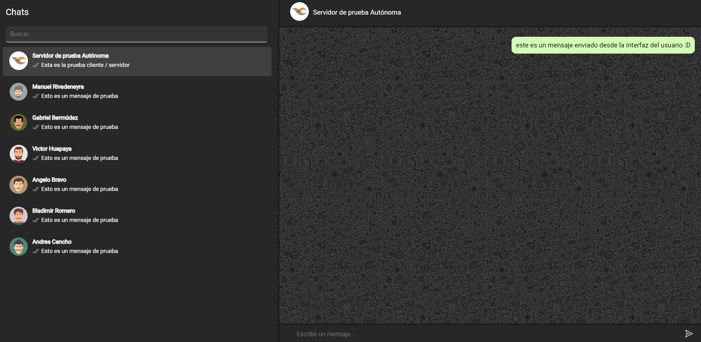
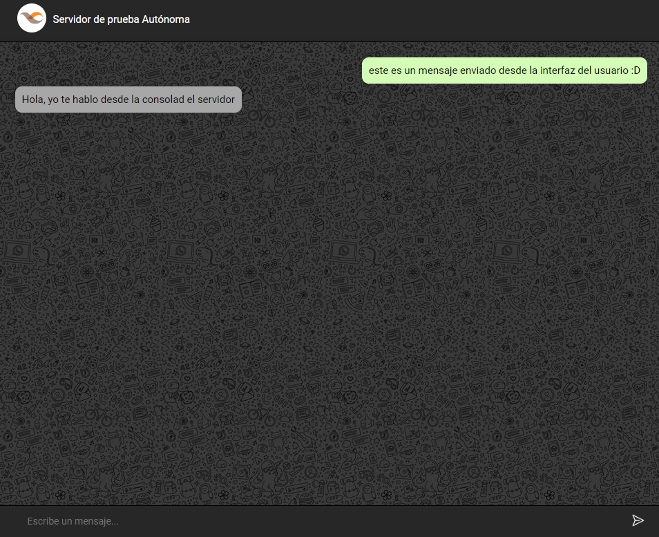
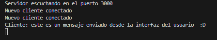
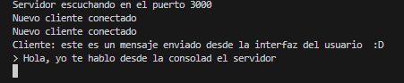

# Chat Web con Socket.IO

Este proyecto implementa un chat web en tiempo real de cliente / servidor utilizando Socket.IO
## Contenido

- [Instalación](#instalación)
- [Uso](#uso)
- [Contribución](#contribución)
- [Agradecimientos](#agradecimientos)
- [Capturas de Pantalla](#capturas-de-pantalla)
## Instalación

Asegúrate de tener Node.js y npm instalados en tu computador.

```bash
npm install
```

## Uso

Para iniciar el servidor puede usar una de las opciones.

```bash
node server.js 
npm start
```
## Contribuciones

Actualmente no se aceptan contribuciones para este proyecto.

# Capturas de pantalla
- Interfaz de usuario 



- Interfaz de servidor
 

